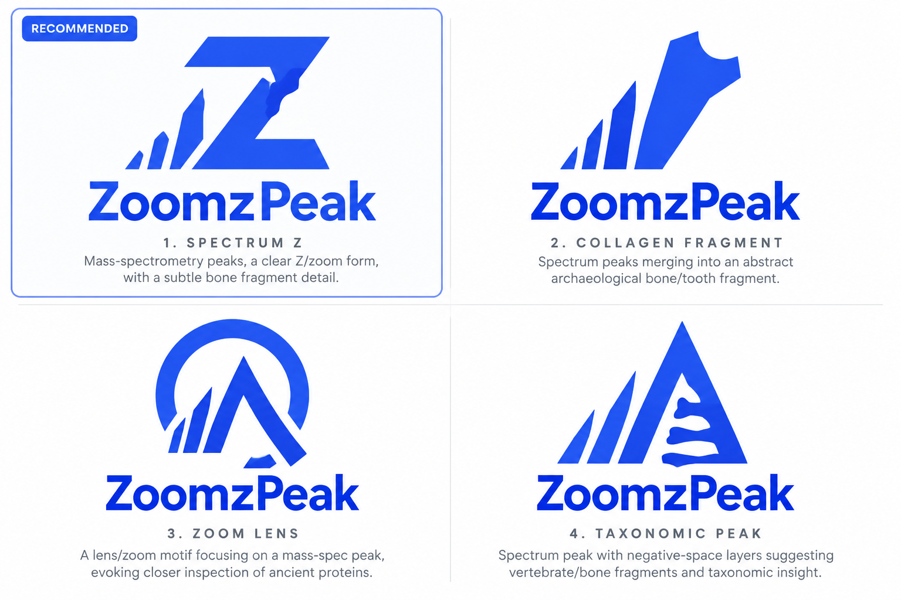

# ZoomzPeak

**An open, ontology-anchored Parquet format for ZooMS and palaeoproteomics data.**

A [**PAASTA**](https://paasta-community.github.io/) initiative — Palaeoproteomics
And Archaeology, Society for Techniques and Advances, a [EuPA](https://eupa.org/)
initiative and an early-career-driven open-science community.

> **Pre-release.** The specification is being drafted in the open and nothing here
> is stable yet. See [`PLAN.md`](PLAN.md) for the full design and migration plan,
> and [open an issue](../../issues) or join the chat (below) to shape it.

---

## What this is

ZooMS (Zooarchaeology by Mass Spectrometry) and palaeoproteomics produce data that
falls between two communities' standards:

- **Mass-spectrometry formats** ([mzML](https://www.psidev.info/mzML), and its
  successor [mzPeak](https://www.mzpeak.org/)) describe the measurement well, but
  assume a chromatographic run. A MALDI-ToF ZooMS spectrum has one spectrum per
  sample and **no time axis** at all.
- **Archaeological data standards** ([CIDOC-CRM](https://www.cidoc-crm.org/),
  [LADO](https://archaeology.link/), ARIADNEplus) describe the sample's context —
  site, period, material, taxon — but say nothing about spectra.

A ZooMS dataset needs both halves, and today most of it is shared as loose
spreadsheets with the context living only in the paper. ZoomzPeak is an attempt to
fix that: a columnar format that is fast to query, honest about what it does and
does not know, and bound to real controlled vocabularies on **both** sides.

`mzPeakMS-ZooMS` is defined as a **profile of mzPeak** rather than a rival format.

## Status

| Piece | State |
|---|---|
| Design plan | Drafted — [`PLAN.md`](PLAN.md) |
| Builders (ZooMS MS1, LC-MS/MS MS2, MS1 envelopes) | In migration from private repos |
| Vocabulary bindings (`vocab/`) | Not yet written |
| Specification (`spec/`) | Not yet written |
| Validator | Not yet written |

## Design principles

1. **Never fabricate a field.** An unconfirmed value stays blank and says why.
   Every metadata field records *how it was established*, not just its value.
2. **No forced mappings.** Where a ZooMS concept has no honest equivalent in an
   existing vocabulary, we say so rather than borrowing a term that means something
   else. MALDI has no retention time, so we do not pretend it does.
3. **Ontology bindings are data, not code.** Terms live in `vocab/*.yaml` with an
   explicit `status` (`stable` / `provisional` / `local`), so a vocabulary maturing
   is a one-file edit rather than a schema migration.
4. **The data stays where it is.** This repository holds code and specification
   only — no spectra, no raw files.

## Standards and communities we build on

| | |
|---|---|
| [**mzPeak**](https://www.mzpeak.org/) | HUPO-PSI's successor to mzML. `mzPeakMS-ZooMS` is a profile of it. |
| [**PSI-MS CV**](https://www.ebi.ac.uk/ols4/ontologies/ms) | Controlled vocabulary for the measurement half. |
| [**LADO**](https://github.com/archaeolink/lado) | Linked Archaeological Data Ontology (LEIZA), CC-BY-4.0. Anchors the archaeological half. |
| [**archaeology.link**](https://archaeology.link/) / [NFDI4Objects](https://www.nfdi4objects.net/) | The LOD hub LADO is published through. |
| [**ARCH-ON**](https://seco.cs.aalto.fi/projects/arch-on/) | Archaeological knowledge representation (Helsinki / KU Leuven / Aalto). Tracked; no namespace published yet. |
| [**SDRF-Proteomics**](https://github.com/bigbio/proteomics-sample-metadata) | Sample-metadata sidecars. |

## Contributing

The most useful contribution right now is **archaeological context for existing
datasets** — taxon, site, period, citation — and **review of the vocabulary
bindings**, especially any marked `provisional`. See [`CONTRIBUTING.md`](CONTRIBUTING.md).

If your lab's ZooMS peaklist format does not load, that is a bug worth reporting.

## Community and discussion

ZoomzPeak is a **PAASTA** initiative. PAASTA is an international, early-career-led
community for palaeoproteomics, committed to open and collaborative science, and
running under [EuPA](https://eupa.org/). A community-owned data standard is exactly
the kind of thing it exists to make possible — so this is not a format one lab is
publishing and inviting comment on, it is one the community is building.

- **[Matrix / Element room](https://matrix.to/#/!QpobrZgJZFYpmEnoKa:matrix.org?via=matrix.org&via=archaeo.social)**
  — development of this metadata standard, day to day
- [PAASTA community site](https://paasta-community.github.io/)

If you work with ZooMS or ancient proteins and something here does not fit how your
lab actually works, saying so is the most valuable thing you can do. See
[`CONTRIBUTING.md`](CONTRIBUTING.md).

### Related community work

This project builds on the standards conversation PAASTA and the wider community
are already having, in particular Dekker et al., *Open science, communication, and
collaboration for the future of palaeoproteomics*, and ongoing work on emerging
standards in the field.

## Licence

- **Code** — [Apache-2.0](LICENSE)
- **Specification and `vocab/`** — [CC-BY-4.0](LICENSE-SPEC)
- **The ZoomzPeak name and logo** are not covered by either licence. All rights
  reserved.

## Citation

See [`CITATION.cff`](CITATION.cff). A DOI will be minted at v0.1.
