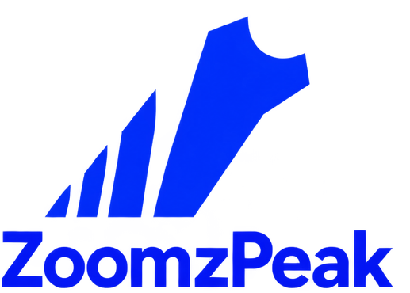

# ZoomzPeak

**A community standard for palaeoproteomics experiment metadata — and one
compressed data format for both halves of the experiment.**

A [**PAASTA**](https://paasta-community.github.io/) initiative — Palaeoproteomics
And Archaeology, Society for Techniques and Advances, a [EuPA](https://eupa.org/)
initiative and an early-career-led open-science community.

> **Pre-release.** The specification is being drafted in the open and nothing here
> is stable yet. See [`PLAN.md`](PLAN.md) for the full design, and join the
> [Matrix room](https://matrix.to/#/!QpobrZgJZFYpmEnoKa:matrix.org?via=matrix.org&via=archaeo.social)
> to shape it.

---

## Why this exists

Palaeoproteomics has a metadata problem, and it is not a problem of effort. It is
a problem of there being nowhere obvious to put things.

A ZooMS result is not just a spectrum. It is a spectrum **of a specific object** —
an animal bone from a known site, a parchment leaf with a shelfmark, a relic label
from a named collection — analysed with a particular extraction protocol, in a
particular lab, by a particular instrument. Half of that description belongs to
mass spectrometry, and half belongs to archaeology and heritage science.

Today those halves have separate homes and neither is a good fit:

- **Mass-spectrometry formats** — mzML and its successor
  [mzPeak](https://www.mzpeak.org/) — describe the measurement rigorously, with a
  controlled vocabulary behind every term. But they assume a chromatographic run.
  A MALDI-ToF ZooMS acquisition has one spectrum per sample and **no time axis at
  all**.
- **Archaeological data standards** — [CIDOC-CRM](https://www.cidoc-crm.org/),
  [LADO](https://archaeology.link/), ARIADNEplus — describe the object, its site,
  its period and its curation history properly. But they say nothing about
  spectra.

So the context ends up in the paper, or in a supplementary spreadsheet, or in
someone's lab notebook — and the spectra end up in a repository stripped of the
very information that makes them interpretable. Ten years later the data is still
there and the meaning is gone.

**ZoomzPeak is an attempt to give both halves one home**, with real controlled
vocabularies behind each, so that a palaeoproteomics dataset can be deposited,
cited, and re-analysed without the context falling off.

---

## The core idea: one MS1 store for ZooMS *and* LC-MS/MS

This is the technical observation the project is built on, and it is worth
stating plainly because it is what makes the format tractable.

**mzPeak separates data by MS level.** MS1 — survey scans, precursor signal — is
distinct from MS2, the fragment spectra produced by fragmenting a selected
precursor. They are different kinds of measurement and mzPeak treats them as
different kinds of data.

Now look at what palaeoproteomics actually produces:

| Technique | MS1 | MS2 |
|---|---|---|
| **ZooMS** (MALDI-ToF) | one spectrum per sample — peptide masses | *none* — no fragmentation |
| **LC-MS/MS** (shotgun) | precursor survey scans | fragment spectra, the searchable data |

**ZooMS is MS1-only.** It is a peptide mass fingerprint: masses, no fragments. And
LC-MS/MS produces MS1 as well — the precursor signal that its MS2 events were
triggered from.

So the two techniques are not as different, at the data level, as the two
communities around them assume. A ZooMS spectrum and an LC-MS/MS MS1 scan are both
**a list of m/z values with intensities**. The differences that matter — no
retention time, single-shot acquisition, a MALDI matrix instead of a column — are
differences that *metadata* should record, not differences that need two
incompatible file formats.

```
        ZooMS (MALDI-ToF)          LC-MS/MS (shotgun)
               │                      │         │
               │  peptide masses      │ MS1     │ MS2
               │  (no fragmentation)  │ survey  │ fragments
               ▼                      ▼         ▼
        ┌──────────────────────────────────┐  ┌──────────────┐
        │        ONE MS1 STORE             │  │  MS2 STORE   │
        │  same schema, same compression,  │  │              │
        │  same vocabulary bindings        │  │              │
        └──────────────────────────────────┘  └──────────────┘
                          │                          │
                          └────────── one dataset ───┘
                             one set of sample metadata
```

### Why this matters in practice

**Many palaeoproteomics studies run both techniques on the same samples.** ZooMS
first, as a fast and cheap species screen across hundreds or thousands of
specimens; then LC-MS/MS on the interesting subset, for deeper sequence coverage,
post-translational modifications, or a taxonomic assignment ZooMS cannot resolve.

That is one experiment, on one set of samples, with one set of sample metadata.
But it currently produces two entirely separate data estates in two formats, with
the sample metadata duplicated, diverging, or simply absent on one side.

Unifying the MS1 layer means:

- **The screen and the follow-up live in the same dataset.** The link between a
  ZooMS species call and the LC-MS/MS run that confirmed it becomes a join, not a
  filename convention or a line in a methods section.
- **Sample metadata is written once.** Site, taxon, element, extraction protocol,
  period — described one way, for the whole experiment.
- **One compression and query story.** Columnar Parquet, one set of tools, whether
  you are looking at MALDI peak lists or precursor envelopes.
- **Cross-technique questions become askable.** How does ZooMS collagen peak
  intensity relate to LC-MS/MS sequence coverage across a site? Today that
  question requires bespoke plumbing for every study that asks it.

This is not a hypothetical tidiness argument. In the estate that motivated this
project, the ZooMS spectra and the LC-MS/MS MS1 precursor envelopes are already
two separate Parquet trees, built by two pipelines, with two different schemas and
two different compression codecs — describing, in places, the same specimens.

---

## Standards: following HUPO-PSI, not competing with it

**We are not inventing a mass-spectrometry format.** That work is done, it is done
well, and it is done by people whose job it is.

[HUPO-PSI](https://www.psidev.info/) — the Proteomics Standards Initiative —
maintains mzML, the PSI-MS controlled vocabulary, SDRF-Proteomics, and now mzPeak.
ZoomzPeak's position is deliberately downstream of all of it:

- **`mzPeakMS-ZooMS` is defined as a *profile* of mzPeak** — a constrained,
  documented specialisation for single-shot MALDI, using mzPeak's own extension
  mechanisms rather than forking the format. A profile can be recognised; a rival
  format has to be adopted.
- **Every measurement term binds to the PSI-MS CV.** Instrument model, matrix,
  digestion enzyme, centroid versus profile — all resolvable terms, not free text.
- **Sample metadata follows SDRF-Proteomics** where SDRF has a field for it.
- **Where PSI has no honest term, we say so** rather than borrowing one that means
  something adjacent. A wrong CV binding is machine-readable misinformation, and
  it is worse than an empty field because nothing downstream can tell it is wrong.

HUPO-PSI have invited palaeoproteomics involvement, and that conversation is
active. Two questions are going to them directly: whether a chromatography-shaped
format should absorb a technique with no time axis through its extension
mechanism or in the core spec, and confirmation of exactly how MS levels are
separated in the mzPeak data model — the detail this project's architecture leans
on.

### mzPeak, and why it is the inspiration

[mzPeak](https://www.mzpeak.org/) is HUPO-PSI's successor to mzML, currently at
specification v0.9. It is, in its own description, a ZIP archive of Parquet tables
plus a small JSON index — losslessly compressing to roughly 37% of the equivalent
mzML, while supporting cloud-native access and random reads over HTTP.

Three of its decisions are the ones ZoomzPeak inherits:

1. **Columnar Parquet for signal arrays.** Fast, compressed, and directly
   queryable by DuckDB, Polars and Arrow — no bespoke parser required.
2. **Separation by data kind and MS level**, which is the property this project
   builds on (above).
3. **Semantics anchored in a controlled vocabulary**, with a versioned conformance
   profile and a validator — so conformance is a thing you can *check*, not a
   thing you assert in a methods section.

The name is a nod to exactly that debt: ZooMS × mzPeak.

---

## What this repository contains

**Code and specification only. No spectra, no raw files, no data.**

| | |
|---|---|
| [`PLAN.md`](PLAN.md) | Full design and migration plan |
| [`spec/`](spec) | The `mzPeakMS-ZooMS` specification *(not yet written)* |
| [`vocab/`](vocab) | Controlled-vocabulary bindings *(not yet written)* |
| `src/zoomzpeak/` | Reference builders, readers, validator *(in migration)* |
| [`tests/fixtures/`](tests/fixtures) | Synthetic example data |
| [`docs/`](docs) | Documentation, including the [conformance audit](docs/conformance_audit_2026-09-08.md) |

### Conformance levels

Conformance is graded, so a dataset can improve incrementally rather than failing
a single all-or-nothing check:

| Level | Requirement |
|---|---|
| **L0 — Structural** | Column names, types and layout match the schema |
| **L1 — CV-bound** | Every column resolves to a controlled-vocabulary term; instrument is a PSI-MS term, not free text |
| **L2 — Contextualised** | Sample context resolved: taxon, material, site, period, citation — each with a provenance tag saying how it was established |

## Status

| Piece | State |
|---|---|
| Design plan | Drafted |
| Conformance audit of an existing estate | Done — [findings](docs/conformance_audit_2026-09-08.md) |
| Synthetic example fixture | Done |
| Builders (ZooMS MS1, LC-MS/MS MS2, MS1 envelopes) | In migration |
| Vocabulary bindings | Not yet written |
| Specification | Not yet written |
| Validator | Not yet written |

## Design principles

1. **Never fabricate a field.** An unconfirmed value stays blank and records why.
   Every metadata field carries *how it was established*, not just its value — a
   guessed species is worse than an empty one, because nothing downstream can tell
   it was a guess.
2. **No forced mappings.** Where a concept has no honest equivalent in a
   vocabulary, say so. MALDI has no retention time, so we do not pretend it does.
3. **Ontology bindings are data, not code.** Terms live in `vocab/*.yaml` with an
   explicit `status` (`stable` / `provisional` / `local`), so a vocabulary maturing
   is a one-file edit, not a schema migration.
4. **Measurements, not model outputs.** Derived quantities — thermal age is the
   worked example — are versioned model results, not properties of a bone, and
   belong in their own repositories with their model.
5. **The data stays where it is.** This repository never holds spectra.

## Standards and communities we build on

| | |
|---|---|
| [**mzPeak**](https://www.mzpeak.org/) | HUPO-PSI's successor to mzML. `mzPeakMS-ZooMS` is a profile of it. |
| [**PSI-MS CV**](https://www.ebi.ac.uk/ols4/ontologies/ms) | Controlled vocabulary for the measurement half. |
| [**SDRF-Proteomics**](https://github.com/bigbio/proteomics-sample-metadata) | Sample-metadata sidecars. |
| [**LADO**](https://github.com/archaeolink/lado) | Linked Archaeological Data Ontology (LEIZA), CC-BY-4.0. Anchors the archaeological half. |
| [**archaeology.link**](https://archaeology.link/) / [NFDI4Objects](https://www.nfdi4objects.net/) | The Linked Open Data hub LADO is published through. |
| [**CIDOC-CRM**](https://www.cidoc-crm.org/) | The conceptual backbone underneath LADO. |
| [**ARCH-ON**](https://seco.cs.aalto.fi/projects/arch-on/) | Archaeological knowledge representation (Helsinki / KU Leuven / Aalto). Tracked; no namespace published yet. |

## Community

ZoomzPeak is a PAASTA initiative, and that is not a badge — it is where the work
is meant to happen. A data standard written by one lab is not a standard, and
palaeoproteomics is small enough that a genuinely shared format is achievable if
it is built in the open from the start.

The most useful contributions right now:

1. **Archaeological context for datasets** — taxon, site, period, citation. One
   pull request per dataset. This is scholarly work and is credited as authorship.
2. **Review of the vocabulary bindings**, especially any marked `provisional`.
   Telling us a binding is wrong is a real contribution, even without a
   replacement.
3. **Formats that do not load.** If your lab's ZooMS peaklist export is not
   readable, that is a bug worth reporting.

Newcomers and early-career researchers are explicitly welcome. Contributors will
routinely be expert in one half of this and non-expert in the other — that is
expected, and answering across that gap is how a shared standard gets built.

See [`CONTRIBUTING.md`](CONTRIBUTING.md) and
[`CODE_OF_CONDUCT.md`](CODE_OF_CONDUCT.md).

**Discussion:** [Matrix / Element room](https://matrix.to/#/!QpobrZgJZFYpmEnoKa:matrix.org?via=matrix.org&via=archaeo.social)

## Licence

- **Code** — [Apache-2.0](LICENSE)
- **Specification and `vocab/`** — [CC-BY-4.0](LICENSE-SPEC)
- **The ZoomzPeak name and logo** are not covered by either licence. All rights
  reserved. See [`LICENSE-SPEC`](LICENSE-SPEC) for what that does and does not
  permit.

## Citation

See [`CITATION.cff`](CITATION.cff). A DOI will be minted at v0.1. If you rely on
the vocabularies this work maps to — PSI-MS, mzPeak, LADO — please cite those on
their own terms; mapping to a vocabulary does not replace citing it.
